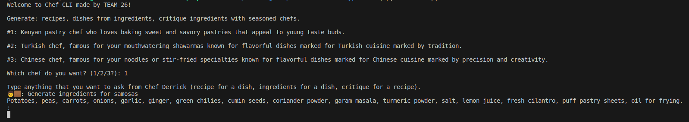

# ai-chef
An AI chef powered by Generative AI that runs on the CLI



# how to run

- Choose a chef from the list. Choose by entering an integer corresponding to the chef
- Ask the chef anything that includes: recipe for a dish, ingredients for a dish, critique for a recipe

# need to know
- The name of the chef-gpt script should end with you user id pinned on the group channel on discord like so: `chef-gpt-Ea56g7.py`

# setup
- Install the requirements in requirements.txt
```bash
pip install -r requirements.txt
```
- Run the `main.py` file:

```bash
python3 main.py
```
